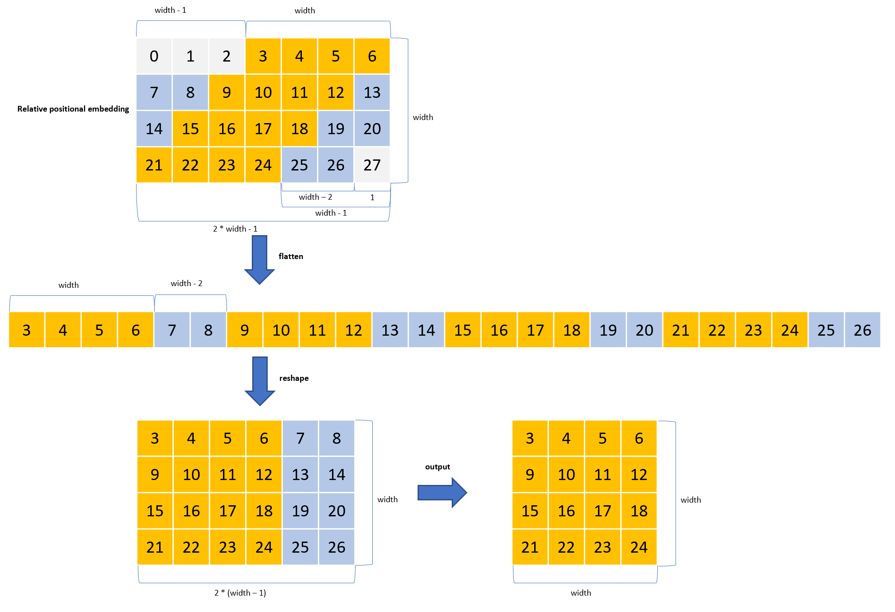

# Keras_botnet
***

## Summary
  - Keras implementation of [botnet](https://gist.github.com/aravindsrinivas/56359b79f0ce4449bcb04ab4b56a57a2). Paper [PDF 2101.11605 Bottleneck Transformers for Visual Recognition](https://arxiv.org/pdf/2101.11605.pdf).
  - Model weights reloaded from [Github BIGBALLON/distribuuuu](https://github.com/BIGBALLON/distribuuuu)
  - HaloAttention also included. Article: [PDF 2103.12731 Scaling Local Self-Attention for Parameter Efficient Visual Backbones](https://arxiv.org/pdf/2103.12731.pdf)
***

## Models
  | Model        | params | Image  resolution | Top1 Acc | Download            |
  | ------------ | ------ | ----------------- | -------- | ------------------- |
  | botnet50     | 21M    | 224               | 77.604   | [botnet50.h5](https://github.com/leondgarse/keras_attention_models/releases/download/botnet/botnet50.h5)  |
## Usage
  ```py
  from tensorflow import keras
  import botnet

  # Reload directly
  mm = keras.models.load_model("../models/botnet50.h5")

  # Or by define model --> load_weights
  mm = botnet.BotNet50(input_shape=(224, 224, 3), classes=1000, strides=1, classifier_activation='softmax')
  mm.load_weights("../models/botnet50.h5", by_name=True)

  # Run prediction
  from skimage.data import chelsea
  imm = keras.applications.imagenet_utils.preprocess_input(chelsea(), mode='torch') # Chelsea the cat
  pred = mm(tf.expand_dims(tf.image.resize(imm, mm.input_shape[1:3]), 0)).numpy()
  print(keras.applications.imagenet_utils.decode_predictions(pred)[0])
  # [('n02124075', 'Egyptian_cat', 0.8791202),
  #  ('n02123159', 'tiger_cat', 0.06439026),
  #  ('n04209239', 'tabby', 0.046073146),
  #  ('n02127052', 'lynx', 0.002341928),
  #  ('n02123045', 'plastic_bag', 0.0022007471)]
  ```
  **Change input resolution**
  ```py
  import botnet
  mm = botnet.BotNet50(input_shape=(480, 480, 3), classes=1000, strides=1)
  bb = keras.models.load_model('../models/botnet50.h5')
  mm.load_weights('../models/botnet50.h5', by_name=True, skip_mismatch=True)
  # WARNING:tensorflow:Skipping loading of weights for layer stack4_block1_2_mhsa due to mismatch in shape ((128, 59) vs (128, 27)).
  # WARNING:tensorflow:Skipping loading of weights for layer stack4_block1_2_mhsa due to mismatch in shape ((128, 59) vs (128, 27)).
  # WARNING:tensorflow:Skipping loading of weights for layer stack4_block2_2_mhsa due to mismatch in shape ((128, 59) vs (128, 27)).
  # WARNING:tensorflow:Skipping loading of weights for layer stack4_block2_2_mhsa due to mismatch in shape ((128, 59) vs (128, 27)).
  # WARNING:tensorflow:Skipping loading of weights for layer stack4_block3_2_mhsa due to mismatch in shape ((128, 59) vs (128, 27)).
  # WARNING:tensorflow:Skipping loading of weights for layer stack4_block3_2_mhsa due to mismatch in shape ((128, 59) vs (128, 27)).

  # Reload mismatched `PositionalEmbedding` weights
  for ii in ['stack4_block1_2_mhsa', 'stack4_block2_2_mhsa', 'stack4_block3_2_mhsa']:
      mm.get_layer(ii).load_resized_pos_emb(bb.get_layer(ii))

  # Run prediction on Chelsea with (480, 480) resolution
  from skimage.data import chelsea
  imm = keras.applications.imagenet_utils.preprocess_input(chelsea(), mode='torch') # Chelsea the cat
  pred = mm(tf.expand_dims(tf.image.resize(imm, mm.input_shape[1:3]), 0)).numpy()
  print(keras.applications.imagenet_utils.decode_predictions(pred)[0])
  # [('n02124075', 'Egyptian_cat', 0.42937067), ('n02123159', 'tiger_cat', 0.3643389), ...]

  mm.save("../models/botnet50_480.h5")
  ```
## Relative to absolute positional embedding detail
  - [How Positional Embeddings work in Self-Attention (code in Pytorch)](https://theaisummer.com/positional-embeddings/)
  - For the first row, length is `2 * width - 1`, elements wanted to keep is the last `width`. So elements cut in the first row is `2 * width - 1 - width == width - 1`.
  - Then **flatten** the last two dimensions, and the number of `cutout elements` between `keep elements` is fixed as `width - 2`.
  - The **reshape** target of the flattened one is `(width, width + width - 2) --> (width, 2 * (width - 1))`
  - Keep the head `width` elements in each row for **output**.
  ```py
  rel_pos = np.arange(28).reshape(1, 1, 1, 4, 7) # [bs, heads, height, width, 2 * width - 1]
  print(rel_pos[0, 0, 0])
  # [[ 0,  1,  2,  3,  4,  5,  6],
  #  [ 7,  8,  9, 10, 11, 12, 13],
  #  [14, 15, 16, 17, 18, 19, 20],
  #  [21, 22, 23, 24, 25, 26, 27]]
  _, heads, hh, ww, dim = rel_pos.shape

  # (ww, 2 * ww - 1) --> (ww, 2 * (ww - 1)) ==> removed: ww * (2 * ww - 1) - ww * 2 * (ww - 1) == ww
  flat_x = rel_pos.reshape([-1, heads, hh, ww * (ww * 2 - 1)])
  print(flat_x[0, 0])
  # [[ 0,  1,  2,  3,  4,  5,  6,  7,  8,  9, 10, 11, 12, 13, 14, 15, 16, 17, 18, 19, 20, 21, 22, 23, 24, 25, 26, 27]]
  flat_x = flat_x[:, :, :, ww - 1:-1]
  print(flat_x[0, 0])
  # [[ 3,  4,  5,  6,  7,  8,  9, 10, 11, 12, 13, 14, 15, 16, 17, 18, 19, 20, 21, 22, 23, 24, 25, 26]]
  final_x = flat_x.reshape([-1, heads, hh, ww, 2 * (ww - 1)])
  print(final_x[0, 0])
  # [[[ 3,  4,  5,  6,  7,  8],
  #   [ 9, 10, 11, 12, 13, 14],
  #   [15, 16, 17, 18, 19, 20],
  #   [21, 22, 23, 24, 25, 26]]]
  final_x = final_x[:, :, :, :, :ww]
  print(final_x[0, 0])
  # [[[ 3,  4,  5,  6],
  #   [ 9, 10, 11, 12],
  #   [15, 16, 17, 18],
  #   [21, 22, 23, 24]]]
  ```
  
## Verification with PyTorch version
  ```py
  """ PyTorch botnet50 """
  import torch
  sys.path.append('../distribuuuu')
  import distribuuuu.models.botnet as torch_botnet

  torch_model = torch_botnet.botnet50()
  torch_model.eval()
  weight = torch.load('../models/botnet50.pth.tar', map_location=torch.device('cpu'))
  torch_model.load_state_dict(weight)

  """ Keras botnet50 """
  import botnet
  mm = keras.models.load_model('../models/botnet50.h5')

  """ Verification """
  inputs = np.random.uniform(size=(1, 224, 224, 3)).astype("float32")
  torch_out = torch_model(torch.from_numpy(inputs).permute(0, 3, 1, 2)).detach().numpy()
  keras_out = mm(inputs).numpy()
  print(f"{np.allclose(torch_out, keras_out, atol=1e-4) = }")
  # np.allclose(torch_out, keras_out, atol=1e-4) = True
  ```
***
