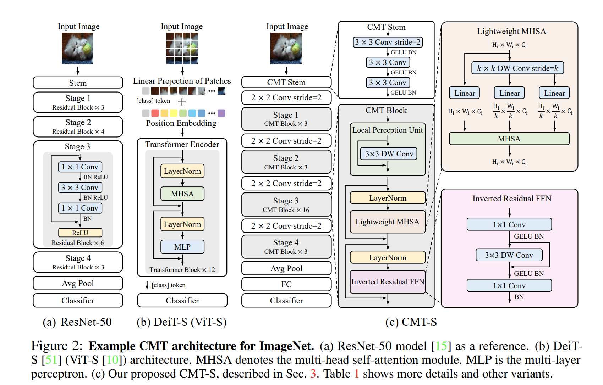
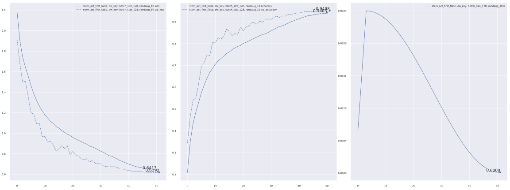

# Keras_CMT
***

## Summary
- CMT article: [PDF 2107.06263 CMT: Convolutional Neural Networks Meet Vision Transformers](https://arxiv.org/pdf/2107.06263.pdf)
- [Github wilile26811249/CMT_CNN-meet-Vision-Transformer](https://github.com/wilile26811249/CMT_CNN-meet-Vision-Transformer)
- No pretraind available.
***

## Models
  

  | Model    | Params | Image resolution | Top1 Acc |
  | -------- | ------ | ---------------- | -------- |
  | CMTTiny  | 9.5M   | 160              | 79.2     |
  | CMTXS    | 15.2M  | 192              | 81.8     |
  | CMTSmall | 25.1M  | 224              | 83.5     |
  | CMTBig   | 45.7M  | 256              | 84.5     |
## Usage
  ```py
  from keras_cv_attention_models import cmt

  # No pretraind available.
  mm = cmt.CMTTiny()
  mm.summary()
  ```
## Cifar10 train test
  ```py
  import tensorflow as tf
  import tensorflow_addons as tfa
  from keras_cv_attention_models import imagenet
  from keras_cv_attention_models import cmt

  gpus = tf.config.experimental.get_visible_devices("GPU")
  for gpu in gpus:
      tf.config.experimental.set_memory_growth(gpu, True)
  tf.keras.mixed_precision.set_global_policy("mixed_float16")

  input_shape = (160, 160, 3)
  batch_size = 128
  lr_base = 1e-2 * batch_size / 512
  optimizer_wd_mul = 1e-1

  model = cmt.CMTTiny(input_shape=input_shape, num_classes=10, drop_connect_rate=0.2, drop_rate=0.2)
  optimizer = tfa.optimizers.AdamW(learning_rate=lr_base, weight_decay=lr_base * optimizer_wd_mul)
  model.compile(optimizer=optimizer, loss=tf.keras.losses.CategoricalCrossentropy(label_smoothing=0.1), metrics=["acc"])
  lr_scheduler = imagenet.CosineLrScheduler(
      lr_base, first_restart_step=48, m_mul=0.5, t_mul=2.0, lr_min=1e-5, warmup=4, steps_per_epoch=-1
  )
  epochs = 48 + 4
  imagenet.train(
      model, epochs=epochs, data_name="cifar10", lr_scheduler=lr_scheduler, input_shape=input_shape,
      batch_size=batch_size, magnitude=10
  )
  ```
  
***
