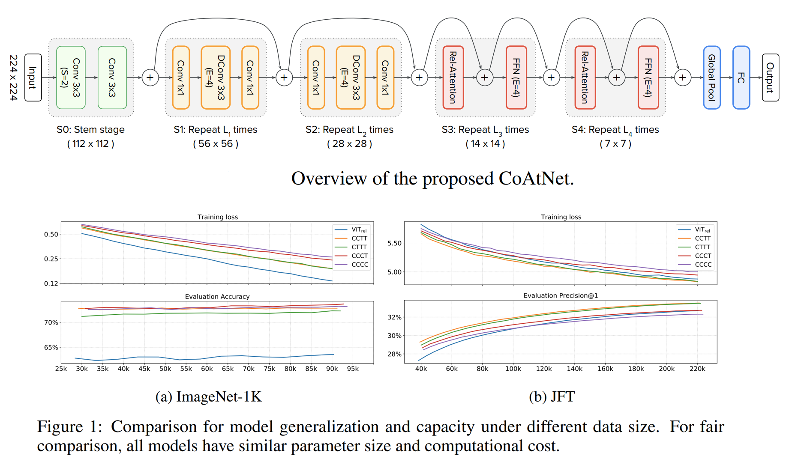

# Keras_CoAtNet
***

## Summary
- CoAtNet article: [PDF 2106.04803 CoAtNet: Marrying Convolution and Attention for All Data Sizes](https://arxiv.org/pdf/2106.04803.pdf)
- [Github comvex/coatnet/model.py](https://github.com/blakechi/ComVEX/blob/master/comvex/coatnet/model.py)
- No pretraind available.
***

## Models
  

  | Model                                | Params | Image resolution | Top1 Acc |
  | ------------------------------------ | ------ | ---------------- | -------- |
  | CoAtNet-0                            | 25M    | 224              | 81.6     |
  | CoAtNet-0                            | 25M    | 384              | 83.9     |
  | CoAtNet-1                            | 42M    | 224              | 83.3     |
  | CoAtNet-1                            | 42M    | 384              | 85.1     |
  | CoAtNet-2                            | 75M    | 224              | 84.1     |
  | CoAtNet-2                            | 75M    | 384              | 85.7     |
  | CoAtNet-2                            | 75M    | 512              | 85.9     |
  | CoAtNet-2, ImageNet-21k pretrain     | 75M    | 224              | 87.1     |
  | CoAtNet-2, ImageNet-21k pretrain     | 75M    | 384              | 87.1     |
  | CoAtNet-2, ImageNet-21k pretrain     | 75M    | 512              | 87.3     |
  | CoAtNet-3                            | 168M   | 224              | 84.5     |
  | CoAtNet-3                            | 168M   | 384              | 85.8     |
  | CoAtNet-3                            | 168M   | 512              | 86.0     |
  | CoAtNet-3, ImageNet-21k pretrain     | 168M   | 224              | 87.6     |
  | CoAtNet-3, ImageNet-21k pretrain     | 168M   | 384              | 87.6     |
  | CoAtNet-3, ImageNet-21k pretrain     | 168M   | 512              | 87.9     |
  | CoAtNet-4, ImageNet-21k pretrain     | 275M   | 384              | 87.9     |
  | CoAtNet-4, ImageNet-21k pretrain     | 275M   | 512              | 88.1     |
  | CoAtNet-4, ImageNet-21K + PT-RA-E150 | 275M   | 384              | 88.4     |
  | CoAtNet-4, ImageNet-21K + PT-RA-E150 | 275M   | 512              | 88.56    |
## Usage
  ```py
  from keras_cv_attention_models import coatnet

  # No pretraind available.
  mm = coatnet.CoAtNet0()
  mm.summary()
  ```
***
