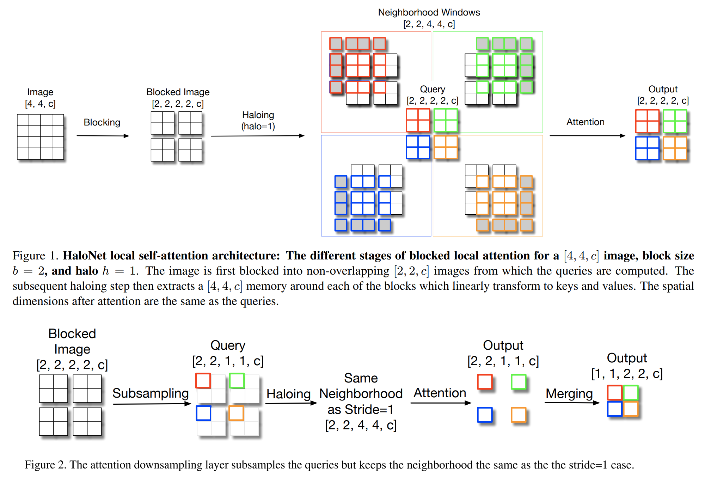

# ___Keras HaloNet___
***

## Summary
  - [Github lucidrains/halonet-pytorch](https://github.com/lucidrains/halonet-pytorch).
  - HaloAttention article: [PDF 2103.12731 Scaling Local Self-Attention for Parameter Efficient Visual Backbones](https://arxiv.org/pdf/2103.12731.pdf).
  - No pretrained available for `H` models. Architecture is guessed from article, so it's NOT certain.
  - `T` model weights are reloaded from timm [Github rwightman/pytorch-image-models](https://github.com/rwightman/pytorch-image-models).
## Models
  

  | Model          | Params | Image resolution | Top1 Acc | Download |
  | -------------- | ------ | ---------------- | -------- | -------- |
  | HaloNetH0      | 5.5M   | 256              | 77.9     |          |
  | HaloNetH1      | 8.1M   | 256              | 79.9     |          |
  | HaloNetH2      | 9.4M   | 256              | 80.4     |          |
  | HaloNetH3      | 11.8M  | 320              | 81.9     |          |
  | HaloNetH4      | 19.1M  | 384              | 83.3     |          |
  | - 21k          | 19.1M  | 384              | 85.5     |          |
  | HaloNetH5      | 30.7M  | 448              | 84.0     |          |
  | HaloNetH6      | 43.4M  | 512              | 84.4     |          |
  | HaloNetH7      | 67.4M  | 600              | 84.9     |          |
  | HaloNet26T     | 12.5M  | 256              | 79.13    | [halonet26t_imagenet.h5](https://github.com/leondgarse/keras_cv_attention_models/releases/download/halonet/halonet26t_imagenet.h5) |
  | HaloNetSE33T   | 13.7M  | 256              | 80.99    | [halonet_se33t_imagenet.h5](https://github.com/leondgarse/keras_cv_attention_models/releases/download/halonet/halonet_se33t_imagenet.h5) |
  | HaloNextECA26T | 10.7M  | 256              | 78.84    | [halonext_eca26t_imagenet.h5](https://github.com/leondgarse/keras_cv_attention_models/releases/download/halonet/halonext_eca26t_imagenet.h5) |
  | HaloNet50T     | 22.7M  | 256              | 81.5 ?   | [halonet50t_imagenet.h5](https://github.com/leondgarse/keras_cv_attention_models/releases/download/halonet/halonet50t_imagenet.h5) |

  Comparing `halo_b7` accuracy by replacing Conv layers with Attention in each stage:

  | Conv Stages | Attention Stages | Top-1 Acc (%) | Norm. Train Time |
  |:-----------:|:----------------:|:-------------:|:----------------:|
  |      -      |    1, 2, 3, 4    |     84.9      |       1.9        |
  |      1      |     2, 3, 4      |     84.6      |       1.4        |
  |    1, 2     |       3, 4       |     84.7      |       1.0        |
  |   1, 2, 3   |        4         |     83.8      |       0.5        |
## Usage
  ```py
  from keras_cv_attention_models import halonet

  # Will download and load pretrained imagenet weights.
  mm = halonet.HaloNet26T(pretrained="imagenet")

  # Run prediction
  import tensorflow as tf
  from tensorflow import keras
  from skimage.data import chelsea
  imm = keras.applications.imagenet_utils.preprocess_input(chelsea(), mode='torch') # Chelsea the cat
  pred = mm(tf.expand_dims(tf.image.resize(imm, mm.input_shape[1:3]), 0)).numpy()
  print(keras.applications.imagenet_utils.decode_predictions(pred)[0])
  # [('n02124075', 'Egyptian_cat', 0.8999013),
  #  ('n02123159', 'tiger_cat', 0.012704549),
  #  ('n02123045', 'tabby', 0.009713952),
  #  ('n07760859', 'custard_apple', 0.00056676986),
  #  ('n02487347', 'macaque', 0.00050636294)]
  ```
***
