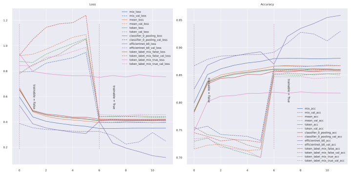

# Keras_volo
***

## Summary
  - Keras implementation of [Github sail-sg/volo](https://github.com/sail-sg/volo). Paper [PDF 2106.13112 VOLO: Vision Outlooker for Visual Recognition](https://arxiv.org/pdf/2106.13112.pdf).
***

## Models
  | Model        | params | Image  resolution | Top1 Acc | Download            |
  | ------------ | ------ | ----------------- | -------- | ------------------- |
  | volo_d1      | 27M    | 224               | 84.2     | [volo_d1_224.h5](https://github.com/leondgarse/keras_cv_attention_models/releases/download/volo/volo_d1_224.h5)  |
  | volo_d1 ↑384 | 27M    | 384               | 85.2     | [volo_d1_384.h5](https://github.com/leondgarse/keras_cv_attention_models/releases/download/volo/volo_d1_384.h5)  |
  | volo_d2      | 59M    | 224               | 85.2     | [volo_d2_224.h5](https://github.com/leondgarse/keras_cv_attention_models/releases/download/volo/volo_d2_224.h5)  |
  | volo_d2 ↑384 | 59M    | 384               | 86.0     | [volo_d2_384.h5](https://github.com/leondgarse/keras_cv_attention_models/releases/download/volo/volo_d2_384.h5)  |
  | volo_d3      | 86M    | 224               | 85.4     | [volo_d3_224.h5](https://github.com/leondgarse/keras_cv_attention_models/releases/download/volo/volo_d3_224.h5)  |
  | volo_d3 ↑448 | 86M    | 448               | 86.3     | [volo_d3_448.h5](https://github.com/leondgarse/keras_cv_attention_models/releases/download/volo/volo_d3_448.h5)  |
  | volo_d4      | 193M   | 224               | 85.7     | [volo_d4_224.h5](https://github.com/leondgarse/keras_cv_attention_models/releases/download/volo/volo_d4_224.h5)  |
  | volo_d4 ↑448 | 193M   | 448               | 86.8     | [volo_d4_448.h5](https://github.com/leondgarse/keras_cv_attention_models/releases/download/volo/volo_d4_448.h5) |
  | volo_d5      | 296M   | 224               | 86.1     | [volo_d5_224.h5](https://github.com/leondgarse/keras_cv_attention_models/releases/download/volo/volo_d5_224.h5) |
  | volo_d5 ↑448 | 296M   | 448               | 87.0     | [volo_d5_448.h5](https://github.com/leondgarse/keras_cv_attention_models/releases/download/volo/volo_d5_448.h5) |
  | volo_d5 ↑512 | 296M   | 512               | 87.1     | [volo_d5_512.h5](https://github.com/leondgarse/keras_cv_attention_models/releases/download/volo/volo_d5_512.h5) |
## Usage
  ```py
  from keras_cv_attention_models import volo

  # Will download and load pretrained imagenet weights.
  mm = volo.VOLO_d5(input_shape=(512, 512, 3), classfiers=2, num_classes=1000, pretrained="imagenet")

  # Run prediction
  from skimage.data import chelsea
  imm = chelsea()  # Chelsea the cat
  pred = mm(tf.expand_dims(tf.image.resize(imm, mm.input_shape[1:3]) / 255, 0)).numpy()
  print(keras.applications.imagenet_utils.decode_predictions(pred)[0])
  # [('n02124075', 'Egyptian_cat', 12.844851),
  #  ('n02123045', 'tabby', 8.998214),
  #  ('n02123159', 'tiger_cat', 8.249916),
  #  ('n02127052', 'lynx', 3.9177818),
  #  ('n02123597', 'Siamese_cat', 2.0154262)]
  ```
  **Change input resolution**
  ```py
  from keras_cv_attention_models import volo
  bb = volo.VOLO_d1(input_shape=(384, 384, 3), classfiers=2, num_classes=1000, mix_token=False)
  # >>>> Load pretraind from: ~/.keras/models/volo/volo_d1_384.h5

  # Define model and load weights.
  mm = volo.VOLO_d1(input_shape=(512, 512, 3), classfiers=2, num_classes=1000, mix_token=False)
  mm.load_weights(os.path.expanduser('~/.keras/models/volo/volo_d1_384.h5'), by_name=True, skip_mismatch=True)
  # WARNING:tensorflow:Skipping loading of weights for layer stack_0_positional due to mismatch in shape ((1, 32, 32, 384) vs (1, 24, 24, 384)).
  mm.get_layer('stack_0_positional').load_resized_pos_emb(bb.get_layer('stack_0_positional'))

  # Run prediction on Chelsea with (384, 384) resolution
  from skimage.data import chelsea
  imm = chelsea()  # Chelsea the cat
  pred = mm(tf.expand_dims(tf.image.resize(imm, mm.input_shape[1:3]) / 255, 0)).numpy()
  print(keras.applications.imagenet_utils.decode_predictions(pred)[0])
  # [('n02124075', 'Egyptian_cat', 12.904753), ('n02123045', 'tabby', 9.088284), ...]

  mm.save("volo_d1_512.h5")
  ```
  **Mixup token**
  ```py
  from keras_cv_attention_models import volo
  mm = volo.VOLO_d1(input_shape=(224, 224, 3), classfiers=2, num_classes=1000, mix_token=True, token_label_top=True)

  from skimage.data import chelsea
  imm = chelsea()  # Chelsea the cat
  out = mm(tf.expand_dims(tf.image.resize(imm, mm.input_shape[1:3]) / 255, 0))
  print(f"{len(out) = }, {out[0].shape = }, {out[1].shape = }")
  # len(out) = 2, out[0].shape = TensorShape([1, 1001]), out[1].shape = TensorShape([1, 196, 1000])
  pred = out[0][:, :-1] + 0.5 * tf.reduce_max(out[1], 1)
  print(keras.applications.imagenet_utils.decode_predictions(pred.numpy())[0])
  # [('n02124075', 'Egyptian_cat', 12.883577), ('n02123045', 'tabby', 8.112266), ... ]
  ```
## Verification with Pytorch model
  ```py
  """ PyTorch volo """
  import torch
  sys.path.append('../volo')
  import models.volo as torch_volo
  from utils import load_pretrained_weights

  model_path = "../models/volo/d5_512_87.07.pth.tar"
  input_shape = 512
  print(f">>>> {model_path = }, {input_shape = }")

  torch_model = torch_volo.volo_d5(img_size=input_shape)
  torch_model.eval()
  load_pretrained_weights(torch_model, model_path, use_ema=False, strict=True, num_classes=1000)

  """ Keras volo """
  from keras_cv_attention_models import volo
  mm = volo.VOLO_d5(input_shape=(512, 512, 3), classfiers=2, num_classes=1000, pretrained="imagenet")

  """ Verification """
  inputs = np.random.uniform(size=(1, input_shape, input_shape, 3)).astype("float32")
  torch_out = torch_model(torch.from_numpy(inputs).permute(0, 3, 1, 2)).detach().numpy()
  keras_out = mm(inputs).numpy()
  print(f"{np.allclose(torch_out, keras_out, atol=1e-6) = }")
  # np.allclose(torch_out, keras_out, atol=1e-6) = True
  ```
## Transfer learning on cifar10
  - [volo_cifar10.ipynb](https://colab.research.google.com/drive/1-uB8lbVLZi_NJARjm06QzVdPPbrCp0FM?usp=sharing)

  
## Training
  - We evaluate our proposed VOLO on the ImageNet dataset. During training, we do not use any extra training data.
  - We use the LV-ViT-S model with Token Labeling as our baseline.
  - We use the AdamW optimizer with a linear learning rate scaling strategy `lr = LRbase × batch_size / 1024` and 5 × 10−2 weight decay rate as suggested by previous work.
  - Stochastic Depth is used.
  - We train our models on the ImageNet dataset for 300 epochs.
  - For data augmentation methods, we use CutOut, RandAug, and the Token Labeling objective with MixToken.
  - We do not use MixUp or CutMix as they conflict with MixToken.

  | Specification    | D1     | D2   | D3   | D4   | D5   |
  | ---------------- | ------ | ---- | ---- | ---- | ---- |
  | MLP Ratio        | 3      | 3    | 3    | 3    | 4    |
  | Parameters       | 27M    | 59M  | 86M  | 193M | 296M |
  | Stoch. Dep. Rate | 0.1    | 0.2  | 0.5  | 0.5  | 0.75 |
  | Crop Ratio       | 0.96   | 0.96 | 0.96 | 1.15 | 1.15 |
  | LRbase           | 1.6e-3 | 1e-3 | 1e-3 | 1e-3 | 8e-4 |
  | weight decay     | 5e-2   | 5e-2 | 5e-2 | 5e-2 | 5e-2 |

  - For finetuning on larger image resolutions, we set the batch size to 512, learning rate to 5e-6, weight decay to 1e-8 and run the models for 30 epochs.
  - Other hyper-parameters are set the same as default.
  - Finetuning requires 2-8 nodes depending on the model size.
***
